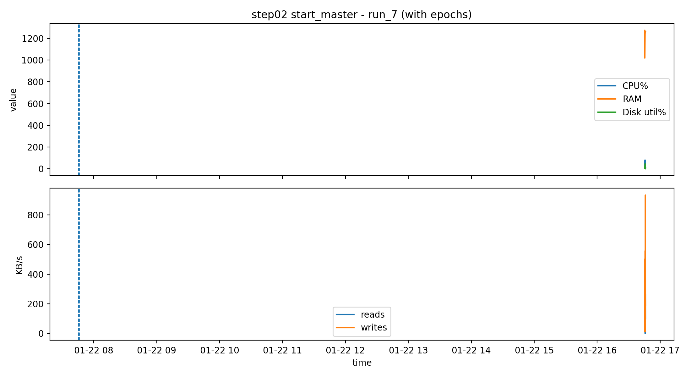

# 한 줄 요약

- ARM64 기반 4노드 K3s 클러스터에서 라이프사이클 이벤트와 TinyLlama 추론 워크로드의 CPU·메모리·디스크·네트워크 사용량 및 처리시간을 반복 측정하고, 재현 가능한 분석 파이프라인으로 정리한 프로젝트

## 실험 목적

K3s에서 특정 작업(시작, 배포, 스케일, 삭제 등)을 할 때 CPU/메모리/디스크 사용량이 얼마나 올라가는지와 그 작업이 끝나는 데 시간이 얼마나 소요되는지 직접 측정하여 정리한다.

또한 동일 시나리오를 반복 실행하여 측정 결과의 분포(평균, 표준편차)와 재현 안정성을 확인한다.

## 질문

1. 라이프사이클 이벤트 종류에 따라 CPU/Memory/Disk 사용량의 변화 패턴(peak, mean)은 어떻게 달라지는가?
2. 각 이벤트의 소요 시간은 어느 정도이며 반복 실행 시 변동 폭(표준편차)은 얼마나 발생하는가?
3. 클러스터 비활성 상태(system idle)와 클러스터 활성 상태(cluster idle)의 기본 오버헤드는 어떻게 다른가?

## 환경 및 수집 방법

- 환경
    - 초기 실험 환경: master 1 + worker 1
    - 확장 실험 환경: master 1 + worker 3
- 아키텍처: ARM64
- 모니터링: netdata를 사용하여 CPU/Memory/Disk 지표를 5초 간격으로 수집
- 이벤트 로그: ansible 실행 로그에 이벤트 시작/종료 시간(start/end timestamp)을 함께 기록
    - 예: 배포 이벤트 종료 시각은 kubectl rollout status 완료 시점으로 정의

## 실험 과정(2노드 환경)

2노드 환경에서는 다수 worker 추가 실험의 의미가 제한적, 운영 관점 이벤트 중심으로 구성

1. **System idle(클러스터 OFF baseline)**
    1. systemctl stop k3s + (worker) systemctl stop k3s-agent
    2. 측정: 300초 고정
2. **Start master**
    1. 시작: systemctl start k3s 실행 시각
    2. 끝: kubectl get nodes에서 master가 Ready가 되는 첫 시작
    3. 측정: start ~ end + (추가 안정화 60초)
3. **Cluster idle(클러스터 ON, 워크로드 없음)**
    1. 조건: nginx 없음, 노드 Ready 상태
    2. 측정: 300초 고정
4. **Apply deployment(nginx, 가능하면 replicas = 3 유지)**
    1. start: kubectl apply 실행 시각
    2. end: kubectl rollout status deployment/nginx 성공 시각
    3. 측정: start ~ end(rollout 완료까지)
5. **Deployment idle(안정화 구간)**
    1. apply 완료 후 300초 고정
6. **Scale up/down(1 → 3 → 1)**
    1. scale down: 3 → 1
        1. start: kubectl scale —replicas=1
        2. end: rollout status 완료
        3. 측정: start ~ end
    2. scale up: 1 → 3
        1. start: kubectl scale —replicas=3
        2. end: rollout status 완료
7. **Rollout restart(재배포 이벤트)**
    1. start: kubectl rollout restart deployment/nginx 실행 시각
    2. end: kubectl rollout status deployment/nginx
8. **Rollout Restart**
    1. start: kubectl rollout restart deployment/nginx
    2. end: kubectl rollout status 성공
    3. 측정: start ~ end
    4. 예상: CPU/Memory spike
9. **Cordon/Uncordon worker(스케줄링 제한/해제) 배포 시 pending/fail 관찰**
    1. Cordon worker
        1. start: kubectl cordon worker 실행
        2. end: 즉시(명령 완료)
        3. 측정: 전후 60초씩
    2. Deploy with cordoned node
        1. nginx scale=3 시도 → pending 관찰
        2. 측정: pending 지속 시간
    3. Uncordon worker
        1. start: kubectl uncordon worker
        2. end: pending pod들이 Running 되는 시점
        3. 측정: start ~ end
10. **Stop/최종 idle**
    1. start: systemctl stop k3s (+worker stop)
    2. end: kubectl get nodes 불가 → inactive 확인 시각
    3. 측정: stop 직후 60초 정도(리소스 하강 관찰)
11. **Delete Deployment**
    1. start: kubectl delete deployment nginx
    2. end: deployment 삭제 확인
    3. 측정: start ~ end
    4. 예상: Memory 감소 

## 분석 방법 및 산출물

**이벤트별 계산**

- Peak / Mean / AUC(누적 사용량) / Duration(소요 시간)

**반복 실험**

- 각 시나리오를 최대 10회 반복하여 평균, 표준편차 및 실행별 변동을 분석했다.

**대표 산출물**

- 이벤트 타임스탬프와 CPU/Memory/Disk/Network 시계열 정렬
- 실행별 Mean / Peak / AUC / Duration 통계
- 반복 실행 결과의 분포 시각화
- TinyLlama HTTP 추론의 readiness 및 요청 지연시간 측정

## 주요 결과

| Event | Runs | Duration Mean | CPU Peak | Memory Mean |
|---|---:|---:|---:|---:|
| Start master | 10 | 43.7 s | 79.4% | 1,192.5 MB |
| Apply deployment | 10 | 6.8 s | 73.6% | 1,391.1 MB |
| Rollout restart | 10 | 9.1 s | 59.1% | 1,422.0 MB |

- Start master는 평균 43.7초로 세 이벤트 중 처리 시간이 가장 길었으며, 평균 CPU peak도 79.4%로 가장 높게 나타났다.
- Apply deployment는 평균 6.8초가 소요되었으며, 배포 과정에서 평균 73.6%의 CPU peak가 관찰됐다.
- Rollout restart는 평균 9.1초가 소요되었으며, 재배포 과정에서 평균 59.1%의 CPU peak가 나타났다.

## 대표 실행 결과

### K3s Master Startup — Run 7

  

K3s master 시작 시점을 START, 노드가 처음 Ready 상태에 도달한 시점을 READY로 정의했다.
시작 직후 CPU 사용량이 증가했으며, Ready 도달 이후 자원 사용량이 점차 안정화되는 패턴을 확인했다.
Run 7의 T_ready는 15초, 전체 관찰 구간 T_total은 45초였으며,
CPU peak는 약 80.3%로 측정됐다.

## 기대 효과

배포 / 스케일 / 롤아웃 / 스케줄링 제한 등의 운영 이벤트에서 발생하는 오버헤드 패턴을 정량적으로 확인할 수 있다.

## 한계

논문과 같은 다수 worker 확장 비교는 제한적이다. 대신 2노드 환경에 적합한 운영 이벤트 중심으로 목표를 명확하게 한다.

- `scripts/`: 실험 자동화 스크립트
- `analysis/`: 통계 계산 및 시각화 코드
- `data/netdata/`: Netdata에서 수집한 시계열 데이터
- `logs/redacted/`: 개인정보와 접속정보를 제거한 실험 로그
- `results/`: 실행별 통계 및 그래프
- `docker/`: TinyLlama HTTP 추론 환경 구성
