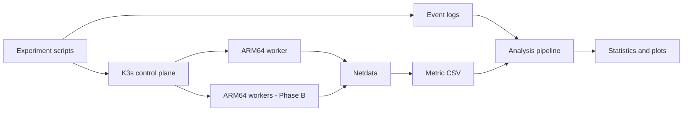

# K3s Lifecycle & TinyLlama Workload Profiling

[](https://github.com/msmsms1125/k3s-lifecycle-profiling/actions/workflows/repository-quality.yml)

ARM64 기반 소형 K3s 클러스터에서 클러스터 시작·배포·스케일링·재시작·삭제와
TinyLlama 추론 워크로드의 처리시간 및 시스템 자원 변화를 반복 측정한 프로젝트입니다.

> **현재 상태:** 기존 하드웨어를 더 이상 사용할 수 없어 과거 실험을 재수행하지
> 못했습니다. 라이프사이클 처리시간은 기존 이벤트 로그에서 확인할 수 있지만,
> 5초 간격 자원 측정치는 짧은 이벤트의 정밀 benchmark가 아닌 참고용 시계열입니다.
> 과거 step17 결과는 실제 1 RPS를 입증하지 못해 검증 제외했습니다.
> 자세한 판단 기준은 [결과 유효성 문서](docs/RESULT_VALIDITY.md)를 참고하세요.

## 프로젝트에서 확인하려던 것

1. 클러스터 라이프사이클 이벤트마다 완료시간과 자원 사용 패턴이 어떻게 다른가?
2. 같은 이벤트를 반복했을 때 결과의 변동 폭은 어느 정도인가?
3. K3s 비활성 상태, 유휴 상태, 일반 Deployment, LLM 추론 워크로드의 오버헤드는 어떻게 다른가?

## 핵심 엔지니어링 포인트

- **측정 경계 분리:** 이벤트 완료시간과 이후 안정화 구간을 별도 timestamp로 관리해
  처리시간이 과대 계산되지 않도록 했습니다.
- **부하 모델 교정:** 응답 완료를 기다리는 순차 요청을 wall-clock 기반 open-loop
  dispatch로 바꾸어, 서버 지연이 요청률을 낮추는 오류를 제거했습니다.
- **데이터 품질 guard:** timestamp 정렬·중복 제거, metric column 모호성, utilization
  범위, 음수 AUC를 검사해 잘못된 통계가 결과물로 저장되지 않게 했습니다.
- **증거 수준 분리:** 이벤트 로그로 재검산 가능한 시간, 참고용 5초 자원 시계열,
  검증 제외 결과를 문서에서 명시적으로 구분했습니다.
- **오프라인 회귀 검증:** 실제 클러스터 없이도 mock SSE 서버로 dispatch 동작을
  검증하고, 문서·의존성·익명화 상태를 CI에서 검사합니다.

## 테스트베드 범위

| Phase | 구성 | 목적 |
|---|---|---|
| A | master 1 + worker 1 | K3s 라이프사이클 이벤트 측정 |
| B | master 1 + worker 3 | TinyLlama 배포·스케일·추론 워크로드 확장 실험 |

- Architecture: ARM64 / aarch64
- K3s: `v1.34.3+k3s1`
- Monitoring: Netdata, 5초 평균으로 export
- Event clock: Unix epoch second
- 상세 사양: [`docs/setup`](docs/setup)


```mermaid
flowchart LR
    R[Experiment scripts] --> K[K3s control plane]
    K --> W1[ARM64 worker]
    K --> W2[ARM64 workers - Phase B]
    W1 --> N[Netdata]
    W2 --> N
    R --> L[Event logs]
    N --> D[Metric CSV]
    L --> A[Analysis pipeline]
    D --> A
    A --> O[Statistics and plots]
```

## 실험 매트릭스

| Step | Scenario | 보존된 run | 결과 상태 |
|---:|---|---:|---|
| 01 | System idle | 10 | 참고용 |
| 02 | Start master | 10 | 시간 유효 / 자원 참고용 |
| 03 | Cluster idle | 10 | 참고용 |
| 04 | Apply nginx Deployment | 10 | 시간 유효 / 자원 참고용 |
| 05 | Nginx Deployment idle | 10 | 참고용 |
| 06 | Scale up/down | 10 | 시간 유효 / 일부 지표 누락 |
| 07 | Rollout restart | 10 | 시간 유효 / 자원 참고용 |
| 08 | Cordon/uncordon | 10 | 일부 지표 누락 |
| 09 | Stop cluster / final idle | 1 | 탐색적 결과 |
| 10 | Delete nginx Deployment | 10 | 시간 유효 / 자원 정밀도 제한 |
| 11 | Network observation | 10 | 참고용 |
| 12 | Apply TinyLlama HTTP | 10 | 참고용 |
| 13 | TinyLlama idle | 10 | 참고용 |
| 14 | TinyLlama scale up/down | 10 | 참고용 |
| 15 | TinyLlama rollout restart | 10 | 참고용 |
| 16 | Delete TinyLlama Deployment | 1 | 탐색적 결과 |
| 17 | Scheduled TinyLlama inference load | 10 | **기존 결과 검증 제외** |

`참고용`은 원시 Netdata CSV가 저장소에 없어 재계산할 수 없거나, 5초 집계보다
짧은 이벤트가 포함되어 resource peak/AUC를 정밀 수치로 해석할 수 없다는 뜻입니다.

## 로그에서 확인 가능한 대표 처리시간

| Event | Runs | Mean | 해석 |
|---|---:|---:|---|
| Master start → Ready | 10 | 13.7 s | 기존 README의 43.7초에는 Ready 이후 30초 안정화 구간이 포함되어 있었음 |
| Apply nginx → rollout complete | 10 | 6.8 s | 이벤트 timestamp 기준 |
| Rollout restart → complete | 10 | 9.1 s | 이벤트 timestamp 기준 |

위 시간은 초 단위 이벤트 로그에서 계산한 기술통계이며 다른 하드웨어에 일반화할 수
있는 성능 기준값은 아닙니다. CPU·RAM·Disk peak 수치는 샘플링 한계 때문에 대표
성과 수치에서 제외했습니다.

## Step17 교정 사항

기존 `load_1rps.py`는 한 요청이 끝난 뒤 다음 요청을 보내는 순차 방식이어서,
느린 응답이 클라이언트 backlog로 누적되었습니다. 그 결과는 지속적인 1 RPS 부하를
입증하지 못합니다. 현재 코드는 다음을 반영했습니다.

- wall-clock schedule에 따라 다음 요청을 독립적으로 보내는 open-loop dispatch
- planned RPS와 achieved dispatch RPS 분리 기록
- HTTP 성공률, dispatch delay, TTFT/total latency p50·p95 기록
- SSE의 실제 생성 텍스트 이벤트를 기준으로 TTFT 측정
- 시간순 정렬 후 AUC 계산
- CPU와 Disk utilization의 `0~100%` 범위 검증
- 음수 방향으로 표현되는 Netdata 송신량을 magnitude로 정규화
- 수집·분석 실패 시 성공으로 처리하지 않음

이 교정 코드는 기존 하드웨어에서 다시 실행되지 않았으므로 새로운 benchmark 결과를
제시하지 않습니다.

## 실행 환경과 사용 방법

Python 분석 의존성은 다음과 같이 설치할 수 있습니다.

```bash
python3 -m venv .venv
source .venv/bin/activate
pip install -r requirements.txt
```

하드웨어 없이 가능한 저장소 검증은 다음과 같습니다.

```bash
python tools/verify_repository.py
MPLBACKEND=Agg python -m unittest discover -s tests -v
```

검증 범위와 실제 재실험에 필요한 산출물은
[재현성 가이드](docs/REPRODUCIBILITY.md)에 정리했습니다. CI 통과는 코드와 공개
산출물의 일관성을 뜻하며, Raspberry Pi benchmark를 재실행했다는 뜻은 아닙니다.

실제 step17 수집에는 실행 가능한 K3s/Netdata/TinyLlama 환경과 `kubectl`, `curl`,
`jq`가 필요합니다.

```bash
RUNS=10 RPS=1 LOAD_DURATION_SEC=60 \
  scripts/step17_infer_load_1rps_tinyllama_http/run_all.sh
```

현재 저장소에는 과거 원시 Netdata 데이터가 없으므로 기존 결과의 재분석 명령은
제공하지 않습니다. 향후 실행에서는 `data/netdata/`의 원시 CSV와 환경 snapshot을
함께 보존해야 합니다.

## 저장소 구성

- `scripts/`: 실험 수집 및 자동화 스크립트
- `analysis/`: 통계 계산과 시각화 코드
- `logs/redacted/`: 공개 가능한 이벤트 로그
- `results/`: 과거 실행별 통계와 그래프
- `docker/`: TinyLlama HTTP 환경
- `docs/`: 설치 기록, 장비 사양, 결과 유효성 설명
- `tests/`: Step17 부하·분석 로직의 하드웨어 독립 회귀 테스트
- `tools/`: 문서 링크, step 구조, 의존성, 공개 로그 익명화 검사
- `.github/workflows/`: pull request와 push에서 실행되는 오프라인 품질 gate

## 주요 한계

- 기존 physical ARM64 클러스터를 더 이상 사용할 수 없어 재실험할 수 없습니다.
- 5초 모니터링 집계는 1~10초 수준 이벤트의 순간 peak 측정에 충분하지 않습니다.
- 원시 Netdata CSV와 step17 요청 원본이 보존되지 않아 과거 파생 통계를 재검산할 수 없습니다.
- 결과는 단일 홈랩 환경의 관측값이며 K3s 일반 성능으로 해석할 수 없습니다.
