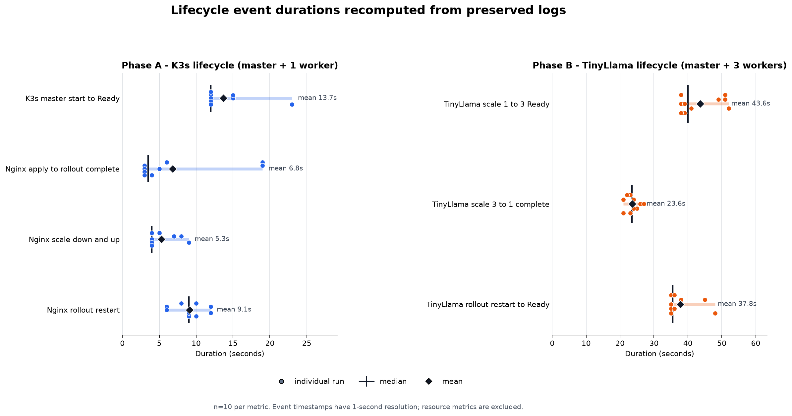

# K3s Lifecycle & TinyLlama Workload Profiling

ARM64 기반 소형 K3s 클러스터에서 클러스터 시작·배포·스케일링·재시작·삭제와
TinyLlama 추론 워크로드의 처리시간 및 시스템 자원 변화를 반복 측정한 프로젝트입니다.

> **현재 상태:** 기존 하드웨어를 더 이상 사용할 수 없어 과거 실험을 재수행하지
> 못했습니다. 라이프사이클 처리시간은 기존 이벤트 로그에서 확인할 수 있지만,
> 5초 간격 자원 측정치는 짧은 이벤트의 정밀 benchmark가 아닌 참고용 시계열입니다.
> 과거 step17 결과는 실제 1 RPS를 입증하지 못해 검증 제외했습니다.

## 요약
- 2개 테스트베드 phase에서 K3s와 TinyLlama의 17개
  lifecycle/workload 시나리오를 자동 수집·분석하는 파이프라인을 만들었습니다.
- 공개 이벤트 로그 60개에서 7개 lifecycle 시간 지표,
  총 70개 관측값을 다시 계산했습니다. 각 지표는 10회 반복의 평균·중앙값·범위를
  함께 제시합니다.
- 안정화 대기시간이 처리시간에 섞인 문제와 응답 지연이 요청률을
  낮춘 순차 부하 생성기를 찾아 측정 경계와 dispatch 방식을 교정했습니다.
- 재계산 가능한 이벤트 시간, 참고용 자원 시계열,
  검증 제외 Step17 결과를 분리하고 이를 테스트와 CI로 고정했습니다.

## 프로젝트에서 확인하려던 것
1. 클러스터 라이프사이클 이벤트마다 완료시간과 자원 사용 패턴이 어떻게 다른가?
2. 같은 이벤트를 반복했을 때 결과의 변동 폭은 어느 정도인가?
3. K3s 비활성 상태, 유휴 상태, 일반 Deployment, LLM 추론 워크로드의 오버헤드는 어떻게 다른가?

## 핵심 엔지니어링 포인트
- 이벤트 완료시간과 이후 안정화 구간을 별도 timestamp로 관리해
  처리시간이 과대 계산되지 않도록 했습니다.
- 응답 완료를 기다리는 순차 요청을 wall-clock 기반 open-loop
  dispatch로 바꾸어, 서버 지연이 요청률을 낮추는 오류를 제거했습니다.
- timestamp 정렬·중복 제거, metric column 모호성, utilization
  범위, 음수 AUC를 검사해 잘못된 통계가 결과물로 저장되지 않게 했습니다.
- 이벤트 로그로 재검산 가능한 시간, 참고용 5초 자원 시계열,
  검증 제외 결과를 문서에서 명시적으로 구분했습니다.
- 실제 클러스터 없이도 mock SSE 서버로 dispatch 동작을
  검증하고, 문서·의존성·익명화 상태를 CI에서 검사합니다.

## 테스트베드 범위
| Phase | 구성 | 목적 |
|---|---|---|
| A | master 1 + worker 1 | K3s 라이프사이클 이벤트 측정 |
| B | master 1 + worker 3 | TinyLlama 배포·스케일·추론 워크로드 확장 실험 |
- Architecture: ARM64 / aarch64
- K3s: `v1.34.3+k3s1`
- Monitoring: Netdata, 5초 평균으로 export
- Event clock: Unix epoch second
- 상세 사양: [`docs/setup`](docs/setup)

## 실험 매트릭스
| Step | Scenario | 보존된 run | 결과 상태 |
|---:|---|---:|---|
| 01 | System idle | 10 | 참고용 |
| 02 | Start master | 10 | 시간 유효 / 자원 참고용 |
| 03 | Cluster idle | 10 | 참고용 |
| 04 | Apply nginx Deployment | 10 | 시간 유효 / 자원 참고용 |
| 05 | Nginx Deployment idle | 10 | 참고용 |
| 06 | Scale up/down | 10 | 시간 유효 / 일부 지표 누락 |
| 07 | Rollout restart | 10 | 시간 유효 / 자원 참고용 |
| 08 | Cordon/uncordon | 10 | 일부 지표 누락 |
| 09 | Stop cluster / final idle | 1 | 탐색적 결과 |
| 10 | Delete nginx Deployment | 10 | 시간 유효 / 자원 정밀도 제한 |
| 11 | Network observation | 10 | 참고용 |
| 12 | Apply TinyLlama HTTP | 10 | 참고용 |
| 13 | TinyLlama idle | 10 | 참고용 |
| 14 | TinyLlama scale up/down | 10 | 참고용 |
| 15 | TinyLlama rollout restart | 10 | 참고용 |
| 16 | Delete TinyLlama Deployment | 1 | 탐색적 결과 |
| 17 | Scheduled TinyLlama inference load | 10 | **기존 결과 검증 제외** |

## 로그에서 다시 계산한 lifecycle 시간

| Phase | Event | Runs | Mean | Median | Range |
|---|---|---:|---:|---:|---:|
| A | K3s master start → Ready | 10 | 13.7 s | 12.0 s | 12–23 s |
| A | Nginx apply → rollout complete | 10 | 6.8 s | 3.5 s | 3–19 s |
| A | Nginx scale down + up | 10 | 5.3 s | 4.0 s | 4–9 s |
| A | Nginx rollout restart | 10 | 9.1 s | 9.0 s | 6–12 s |
| B | TinyLlama scale 1→3 → Ready | 10 | 43.6 s | 40.0 s | 38–52 s |
| B | TinyLlama scale 3→1 → complete | 10 | 23.6 s | 23.5 s | 21–27 s |
| B | TinyLlama rollout restart → Ready | 10 | 37.8 s | 35.5 s | 35–48 s |

## 저장소 구성
- `scripts/`: 실험 수집 및 자동화 스크립트
- `analysis/`: 통계 계산과 시각화 코드
- `logs/redacted/`: 공개 가능한 이벤트 로그
- `results/`: 과거 실행별 통계와 그래프
- `docker/`: TinyLlama HTTP 환경
- `docs/`: 설치 기록, 장비 사양, 결과 유효성 설명
- `docs/PORTFOLIO_CASE_STUDY.md`: 문제·설계·결과·교정 과정을 연결한 포트폴리오 본문
- `docs/REVIEW_GUIDE.md`: 5분 검토 동선, 30초 소개, 이력서·면접 표현 가이드
- `docs/EVIDENCE_MAP.md`: 주장별 증거 등급과 근거 파일
- `tests/`: Step17 부하·분석 로직의 하드웨어 독립 회귀 테스트
- `tools/`: 단일 품질 검사 진입점, 로그 기반 집계와 저장소·익명화 검사
- `.github/workflows/`: pull request와 push에서 실행되는 오프라인 품질 gate

## 주요 한계
- 기존 physical ARM64 클러스터를 더 이상 사용할 수 없어 재실험할 수 없습니다.
- 5초 모니터링 집계는 1~10초 수준 이벤트의 순간 peak 측정에 충분하지 않습니다.
- 원시 Netdata CSV와 step17 요청 원본이 보존되지 않아 과거 파생 통계를 재검산할 수 없습니다.
- 결과는 단일 홈랩 환경의 관측값이며 K3s 일반 성능으로 해석할 수 없습니다.
