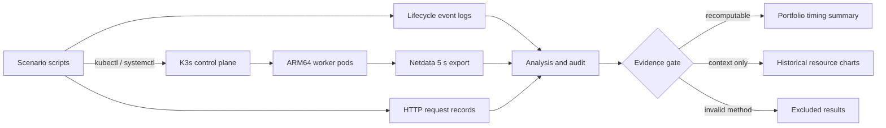

# Portfolio case study: 작은 ARM64 클러스터를 측정하고, 잘못된 측정을 교정한 과정

## 1분 요약

이 프로젝트는 Raspberry Pi 기반 ARM64 K3s 클러스터에서 시스템 유휴 상태부터
Deployment 배포·스케일·재시작·삭제, TinyLlama HTTP 추론까지 17개 시나리오를
자동화하고 반복 관측한 프로젝트입니다.

포트폴리오의 핵심은 가장 큰 숫자가 아니라 **측정값의 증거 수준을 다시 감사한
과정**입니다. 이벤트 종료 후 대기 시간을 처리시간으로 포함했던 경계를 분리했고,
실제 1 RPS를 만들지 못했던 순차 부하 생성기를 open-loop 방식으로 교정했습니다.
원래 장비를 사용할 수 없는 상황에서는 새 결과를 주장하지 않고, 공개 로그로
재계산할 수 있는 이벤트 시간만 A 등급 근거로 남겼습니다.

- 범위: 2개 테스트베드 phase, 17개 lifecycle/workload 시나리오
- 재계산 가능한 핵심 자료: 이벤트 로그 60개, 7개 시간 지표, 총 70개 관측값
- 오프라인 검증: 저장소 구조·문서 링크·익명화 gate와 회귀 테스트
- 현재 한계: 하드웨어 재실험과 원시 Netdata metric 재분석은 불가능

## 문제와 목표

소형 ARM64 장비에서는 control-plane 작업과 LLM pod lifecycle이 제한된 CPU·메모리·
스토리지에 어떤 변화를 만드는지 관측하기 어렵습니다. 그래서 다음 질문을 기준으로
수집 파이프라인을 만들었습니다.

1. K3s와 workload lifecycle 이벤트는 완료까지 얼마나 걸리는가?
2. 같은 이벤트를 반복했을 때 분포가 얼마나 달라지는가?
3. 이벤트 시간과 자원 시계열을 어떤 경계로 수집해야 하는가?
4. 나중에 원래 장비가 없어져도 어떤 결과까지 재검산할 수 있는가?

## 실험 시스템과 데이터 흐름

| Phase | 토폴로지 | 주요 시나리오 |
|---|---|---|
| A | master 1 + worker 1 | K3s 시작, Nginx 배포·스케일·재시작·삭제 |
| B | master 1 + worker 3 | TinyLlama 배포·스케일·재시작·추론 부하 |



## 결과: 로그에서 다시 계산 가능한 이벤트 시간


| Phase | Event | n | Mean | Median | Range |
|---|---|---:|---:|---:|---:|
| A | K3s master start → Ready | 10 | 13.7 s | 12.0 s | 12–23 s |
| A | Nginx apply → rollout complete | 10 | 6.8 s | 3.5 s | 3–19 s |
| A | Nginx scale down + up | 10 | 5.3 s | 4.0 s | 4–9 s |
| A | Nginx rollout restart | 10 | 9.1 s | 9.0 s | 6–12 s |
| B | TinyLlama scale 1→3 → Ready | 10 | 43.6 s | 40.0 s | 38–52 s |
| B | TinyLlama scale 3→1 → complete | 10 | 23.6 s | 23.5 s | 21–27 s |
| B | TinyLlama rollout restart → Ready | 10 | 37.8 s | 35.5 s | 35–48 s |

해석할 때 평균만 보지 않았습니다. 예를 들어 Nginx apply는 중앙값이 3.5초지만
초기 두 run이 각각 19초여서 평균은 6.8초입니다. 이 경우 단일 평균보다 전체 점과
범위를 같이 보여주는 편이 반복 실험의 변동을 더 잘 전달합니다.

Phase B의 TinyLlama lifecycle은 해당 환경에서 수십 초 단위로 관측됐습니다. 다만
Phase A와 B는 노드 수와 workload가 다르므로, 위 표는 각 phase 내부의 기술통계이지
Nginx와 TinyLlama의 통제된 성능 비교가 아닙니다. 모든 timestamp는 1초 해상도이며
다른 하드웨어의 성능 기준값으로 일반화할 수 없습니다.

표와 그림은 [집계 스크립트](../tools/build_portfolio_summary.py)가 공개 로그 60개에서
70개 시간 값을 읽어 생성하며, 수치별 출처는 [증거 맵](EVIDENCE_MAP.md)에서 확인할
수 있습니다.

## 데이터 감사를 통해 발견한 문제

### 1. 처리시간과 안정화 대기시간이 섞여 있었습니다

K3s master 시작 실험의 기존 `END_EPOCH`에는 Ready 이후 30초 안정화 구간이 포함돼
있었습니다. 그래서 43.7초라는 기존 평균 대신 lifecycle 완료에는 `T_READY_SEC`를
사용하도록 측정 경계를 분리했습니다. 보존 로그에서 다시 계산한 Ready 평균은
13.7초입니다.

### 2. 기존 Step17은 지속적인 1 RPS가 아니었습니다

기존 생성기는 한 응답이 끝난 뒤 다음 요청을 보내는 순차 구조였습니다. 응답이
느려질수록 dispatch가 밀렸기 때문에 과거 결과로 계획된 1 RPS를 입증할 수 없습니다.
현재 코드는 wall-clock schedule과 동시 요청을 사용하고, 계획 RPS와 실제 dispatch
RPS를 별도로 기록합니다. mock SSE 서버를 사용하는 오프라인 테스트로 느린 응답
중에도 schedule이 유지되는지를 검증하지만, 이를 새 Raspberry Pi benchmark로
표현하지 않습니다.

### 3. 자원 통계에 방어 로직이 부족했습니다

timestamp 정렬·중복 제거, metric column의 유일성, utilization의 `0~100%` 범위,
음수 AUC를 검사하도록 분석 코드를 강화했습니다. 기존 Step17 결과에는 이 기준을
위반하는 값이 있고 원시 CSV가 없으므로 결과를 수정해 살리는 대신 검증에서
제외했습니다.

## 장비 없이 적용한 검증 전략

| 검증 | 보장하는 것 | 보장하지 않는 것 |
|---|---|---|
| 로그 기반 재집계 | 공개 로그 60개의 70개 시간 값과 포트폴리오 표의 일치 | 원래 장비의 재실행 성공 |
| mock SSE 테스트 | 부하 생성기의 schedule·SSE parsing 동작 | 실제 TinyLlama 처리량 |
| 분석 guard 테스트 | 정렬, 중복, 범위, metric 선택 실패 처리 | 과거 원시 resource 통계 복원 |
| repository quality CI | 코드·문서·구조·익명화의 회귀 방지 | 새 benchmark 생성 |

로컬에서는 다음 명령으로 같은 오프라인 검증을 실행할 수 있습니다.

```bash
python tools/build_portfolio_summary.py --check
python tools/verify_repository.py
MPLBACKEND=Agg python -m unittest discover -s tests -v
```

## 이 프로젝트에서 보여주는 역량

- 17개 실험 시나리오의 shell/Python 자동화와 일관된 artifact 구조 설계
- Kubernetes lifecycle 이벤트, HTTP 요청, 시스템 metric의 수집 경계 설계
- 평균값만 나열하지 않고 분포·표본 수·시간 해상도를 함께 해석하는 습관
- 잘못된 결과를 숨기거나 보정하지 않고 원인, 제외 기준, 교정 코드를 추적 가능하게 보존
- 실제 클러스터가 없는 CI에 맞춰 검증 가능한 범위를 재설계한 경험

## 한계와 다음 실험의 조건

현재 결론은 단일 홈랩 관측이며, 5초 Netdata 집계는 짧은 lifecycle 이벤트의 peak를
정밀하게 포착하지 못합니다. 원시 Netdata CSV가 없어 과거 resource 통계도 현재
코드로 재생성할 수 없습니다.

다음 하드웨어 실행에서는 request CSV, 원시 Netdata CSV, 이벤트 로그, 환경 버전,
container image digest, 모델 checksum을 하나의 run artifact로 보존해야 합니다.
자세한 체크리스트는 [재현성 가이드](REPRODUCIBILITY.md)에 정리했습니다.
